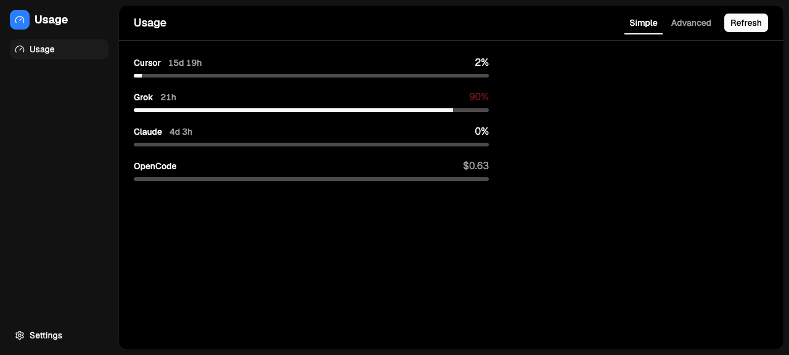
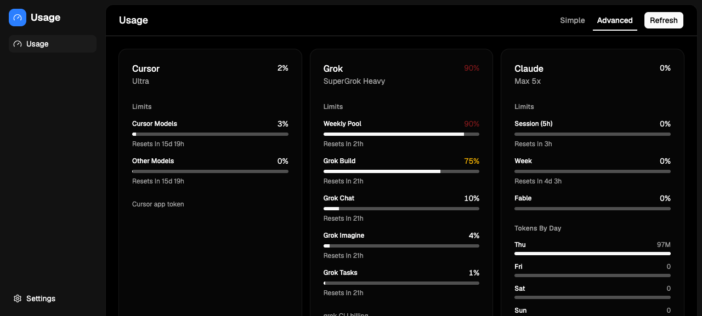

<div align="center">
  
  <h1>Usage Dashboard</h1>
  <h3>local cli usage for cursor, grok, claude, and opencode</h3>
</div>

<br />

Reads usage from the CLIs already signed in on this machine. Nothing is uploaded.

<br />

## 🚀 Quick Start

```bash
bun run install-all
bun run start
```

Frontend: http://localhost:5173 — Backend: http://localhost:8000

Click **Get Started**, then open **Usage**. Sign the CLIs in first (`grok login`, `claude auth login`, Cursor app, optional `opencode`).

<br />

## ✨ Features

### 📊 **Simple View**
- **One row per plan** — name, reset countdown, and the headline number
- **High-contrast bars** — empty track stays visible; 70% warning, 90% destructive
- **Reset next to the name** — `15d 19h`, `21h`, `4d 3h`

### 🧩 **Advanced View**
- **Omarchy-style cards** — Limits, Balance, Tokens By Day, Tokens By Model
- **Per-window bars** — Cursor models vs other, Grok weekly pool / Build / Chat / Imagine / Tasks, Claude session / week / extra
- **Last 7 days** — Claude stats-cache and OpenCode session SQL
- **Top models** — rollups from the same local stores

### 🔌 **Providers**
- **Cursor Ultra** — Cursor app token in `state.vscdb` → `GetCurrentPeriodUsage`
- **SuperGrok Heavy** — `~/.grok/auth.json` → Grok CLI billing (`format=credits`)
- **Claude Max 5x** — live Anthropic oauth usage, then `~/.claude.json` cache
- **OpenCode** — `opencode db` (shown only if the binary is installed)

### ⚙️ **Settings**
- **Refresh Interval** — Manual, 5 Minutes, 15 Minutes, 1 Hour (default 1 Hour)
- **No 30s / 1m** — those rates 429 Claude oauth
- **Refresh button** — always available on the Usage header

### 🔒 **Local Only**
- **No cookies, no cloud account** — tokens already on disk / keychain
- **Nothing is uploaded** — the Node process calls vendor APIs from this machine
- **Optional providers stay hidden** until the binary exists

<br />



<br />

## ⚙️ Configuration

### Frontend

`src/constants.json` sets the product name and tagline. View mode and poll interval live in `localStorage`:

| Key | Values |
|---|---|
| `quota-mode` | `simple` (default) or `advanced` |
| `quota-refresh-ms` | `0`, `300000`, `900000`, `3600000` (default) |

### Backend

No extra env for usage. Collectors read local auth:

| Plan | Auth |
|---|---|
| Cursor | `~/Library/Application Support/Cursor/User/globalStorage/state.vscdb` (`cursorAuth/accessToken`) |
| Grok | `~/.grok/auth.json` (run `grok login` if expired) |
| Claude | macOS keychain `Claude Code-credentials`, or `CLAUDE_CODE_OAUTH_TOKEN`; cache `~/.claude.json` |
| OpenCode | `opencode` on PATH (or `~/.opencode/bin/opencode`) |

Claude `/usage` in the TUI does **not** write `cachedUsageUtilization`. Live oauth is the source; cache is fallback on 429.

<br />

## 🧱 Tech Stack

| Technology | Version | Purpose |
|---|---|---|
| **React** | 19 | Frontend UI |
| **Vite** | 8 | Dev server / build |
| **react-router** | 7 | App routes |
| **Hono** | 4 | Backend HTTP (Node) |
| **Tailwind CSS** | 4 | Styling |
| **skateboard-ui** | 4.x | Shell, Header, shadcn |
| **node:sqlite** | built-in | Cursor `state.vscdb` (read-only) |
| **TypeScript** | 7 | Strict frontend + backend |

<br />

## 🏗️ Architecture

A provider registry in `backend/quotas.ts` loads every plan in parallel. Each collector returns the same `PlanQuota` shape. `GET /api/quotas` is the only usage endpoint.

```
Cursor vscdb token  ──► api2.cursor.sh DashboardService
Grok CLI auth.json  ──► cli-chat-proxy.grok.com/v1/billing
Claude oauth/cache  ──► api.anthropic.com/api/oauth/usage
OpenCode binary     ──► opencode db (SQL JSON)
        │
        ▼
  GET /api/quotas  ──► React Simple / Advanced
```

Internal types, files, and the HTTP path still say `quota` (`QuotaCard`, `/api/quotas`). That is the snapshot shape, not the product name.

<br />

## 🧪 Tests

```bash
bun run test
```

Backend Node tests cover parsers, Claude 429 fallback, missing-reset 0% windows, and OpenCode SQL. Frontend Vitest covers Simple rows, Advanced cards, and the 1 Hour default.

<br />

## 🔗 Related

- [session-review](https://github.com/stevederico/session-review) — local Claude + Grok **transcript** tokens and cost. This app is **plan remaining** (subscription windows), not session logs.

<br />

## 💬 Community & Support

- X: [@stevederico](https://x.com/stevederico)
- Issues: [github.com/stevederico/usage-dashboard/issues](https://github.com/stevederico/usage-dashboard/issues)

<br />

## 🙌 Acknowledgements

- [skateboard-ui](https://github.com/stevederico/skateboard-ui) — application shell
- [Omarchy](https://omarchy.org) — Advanced pane layout (Limits / Tokens By Day / Tokens By Model)

<br />

## 📄 License

[MIT License](LICENSE)

<br />

<div align="center">
  Made with <a href="https://github.com/stevederico/skateboard">Skateboard</a> — a React boilerplate with auth and payments
  <br />
  Built with React, Hono, and Tailwind
  <br />
  <a href="https://github.com/stevederico/usage-dashboard">Star this repo</a>
</div>
